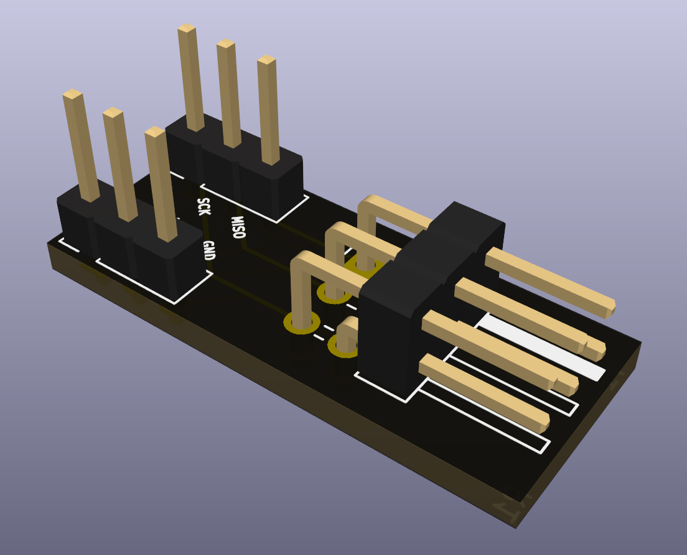
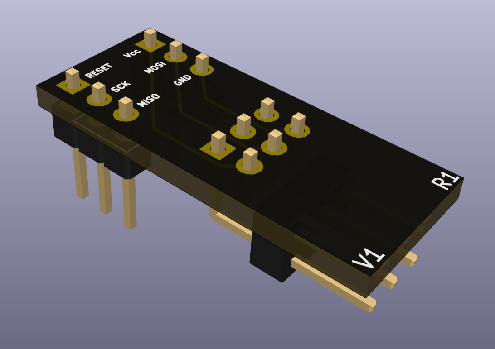

# Atmel ICE ISP Breadboard Breakout

## Introduction

The purpose of this device is to facilitate the connection between an
[Atmel-ICE](https://www.microchip.com/DevelopmentTools/ProductDetails/atatmel-ice)
programmer and a breadboard.

 
Click here to see more pictures

<!-- Perhaps I should do away with this section. -->

